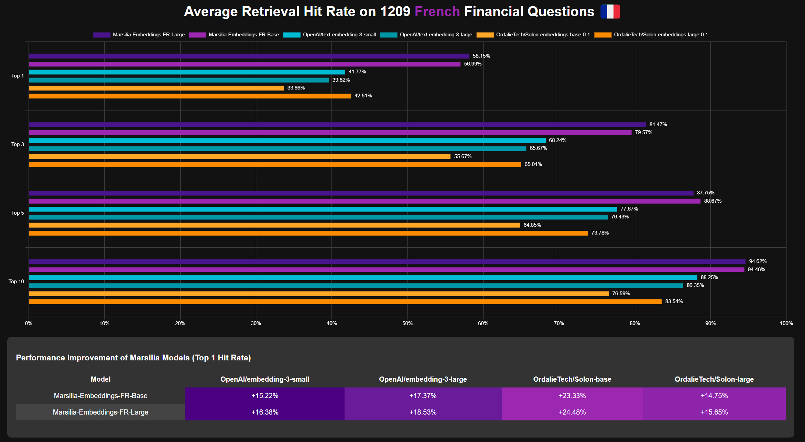

# Virtual Assistant with Integrated RAG System

## Description

This project is a virtual assistant that uses a Retrieval-Augmented Generation (RAG) system to answer questions in the financial domain. The assistant retrieves relevant information from a vector database before generating a response via an LLM model. The responses are strictly based on the available data and limited to the dataset's context.

The application uses **Deepgram** for speech recognition (Speech-to-Text), **Gemini-1.5 flash** for response generation, and **pyttsx** for speech synthesis (Text-to-Speech). The vector database is managed using **Pinecone**, and the embeddings are generated using the French model Marsilia.


## Technical Choices

### Embeddings Model

The embeddings model used is Marsilia-Embeddings-FR-Base, specifically designed to handle French language data with a strong focus on financial domain tasks. By being fine-tuned on financial data, Marsilia-Embeddings-FR-Base outperforms even some closed-source models like OpenAI's embeddings, making it ideal for Retrieval-Augmented Generation (RAG) applications within the financial sector. This demonstrates the power of fine-tuning open-source models for specialized tasks, offering a cost-effective and highly performant solution.


- **Model**: [sujet-ai/Marsilia-Embeddings-FR-Base](https://huggingface.co/sujet-ai/Marsilia-Embeddings-FR-Base)
- **Language**: French 🇫🇷
- **Base Model**: OrdalieTech/Solon-embeddings-base-0.1
- **Maximum Sequence Length**: 512 tokens
- **Output Dimensionality**: 768
- **Similarity Function**: Cosine Similarity

### Vector Database

The vector database is implemented using **Pinecone**, a highly efficient and scalable service for managing vector indexes. Pinecone was selected due to its ability to handle large-scale embeddings and provide fast, real-time search capabilities. One of Pinecone's standout features is its support for cosine similarity, which is well-suited for measuring the semantic closeness of vector representations, such as the embeddings generated by **Marsilia-Embeddings-FR-Base**.

In the context of a financial Retrieval-Augmented Generation (RAG) system, speed and scalability are crucial, especially when processing complex queries and returning relevant results in real time. Pinecone’s infrastructure guarantees low-latency queries and high availability, making it an excellent choice for this application. Additionally, its serverless architecture reduces operational overhead, allowing focus on developing and optimizing the assistant rather than managing the underlying database infrastructure.

- **Pinecone**: Used to store and search embeddings based on user queries and relevant answers.
- **Cosine Similarity**: The distance metric used to measure similarity between vectors is cosine similarity.

## Functionality of the Integrated RAG System


1. **Speech Recognition**:  
   The process begins when the user speaks to the assistant. The spoken input is processed through the Deepgram API, a state-of-the-art speech-to-text solution optimized for accurate transcription in various languages, including French.

2. **Context Search**:  
   After the speech input is converted to text, the system leverages **Marsilia-Embeddings-FR-Base** to transform the user’s query into an embedding vector. This embedding is compared to the existing vectors stored in Pinecone, which houses the pre-embedded financial dataset. Pinecone performs a semantic search, utilizing cosine similarity to retrieve the context that best matches the user's query.

3. **Response Generation**:  
   Once the most relevant context is retrieved from the vector database, the system uses the **Gemini-1.5 flash** language model to generate a response. What distinguishes this system is that the response is strictly constrained by the content found in the dataset—ensuring no hallucinated or out-of-scope information is provided.

4. **Speech Synthesis**:  
   After generating a text-based response, the assistant reads the response back to the user using the **pyttsx** text-to-speech engine. The combination of speech synthesis and the integrated fallback mechanisms ensures the user experiences a smooth and conversational interaction, with real-time voice feedback that maintains the natural flow of conversation.

## Observations and Modifications

### Interaction Management Between User and Assistant

The interaction model follows a process of speech recognition, semantic search, and response generation. To enhance this interaction, several modifications have been made:

- **Silence Detection**: A crucial feature for managing when the assistant should stop listening is the implementation of silence detection. The assistant calculates the decibel level (dB) of the input audio in real time. If the audio drops below a certain threshold (set in the configuration file) and remains silent for a specified duration, the assistant assumes the user has finished speaking and stops listening. This prevents premature interruptions or extended waiting times.

- **STOP Command**: To give the user control over when they want to end the interaction, a stop command (`"stop"`) has been implemented. When the assistant detects this specific word in the user’s speech, it immediately terminates the conversation and exits the program, making the interaction more user-friendly and allowing users to stop the program without having to manually interrupt the execution.

### Limiting Out-of-Context Responses

Given the financial domain's sensitivity, it is vital that the assistant remains focused on providing relevant, in-domain answers. Several safeguards have been implemented:

- **Query Filtering**: The assistant uses a combination of static and dynamically generated financial keywords to filter the user’s queries. Queries outside the financial domain trigger a polite message informing the user that the assistant only handles financial queries. This ensures that the system remains relevant to its use case.

- **Keyword Lists**: Two sources of keywords have been combined for better filtering:

  - **Static Keywords**: A predefined list of financial terms is hardcoded in the `config.json` file.
  - **Dynamic Keywords**: These keywords are dynamically generated by analyzing the dataset’s most common words from both the questions and context fields. By leveraging the most frequent terms from real data, the system is able to identify relevant financial queries more effectively.

- **Response Filtering**: After generating a response, the assistant checks whether the response is aligned with the retrieved context. If the response deviates significantly from the context, a fallback mechanism is activated, and the user is notified that the assistant cannot provide an answer.

### Database Population and Optimization

To ensure that the system can retrieve relevant information efficiently, several decisions were made while populating the Pinecone vector database:

- **Combining Queries and Context**: During the population(`upsert`) of the database, each entry was processed by concatenating the user’s question and the corresponding context. This combined text was then embedded into a vector. This approach improves retrieval accuracy, as the query and context are tightly linked, allowing for more effective searches based on user input.

- **Chunking the Context**: Given the token limitations of the embedding model, the context was divided into smaller chunks with overlap. This ensures that each chunk can be embedded without exceeding the maximum token limit, while also providing the flexibility to search across multiple context fragments when needed.

- **Batching for Faster Upserts**: The data was uploaded to Pinecone in batches to enhance the efficiency of the process. This method was crucial in reducing the time required for data ingestion. Using batching ensures a faster upsert operation, improving scalability and performance. Pinecone's official documentation on batch upserts can be found [here](https://docs.pinecone.io/guides/data/upsert-data).

## Strategies to Limit Out-of-Context Responses

### 1. Query Filtering

To ensure that the assistant processes only relevant financial queries, a filtering system compares the words in the user’s query against a list of financial keywords. These keywords are dynamically generated from the dataset’s most common terms, ensuring that the assistant stays aligned with the financial domain. If the query doesn’t match the financial terms, the assistant returns a message stating that it can only handle financial-related questions.

### 2. Specific Prompt to Guide Response Generation

The assistant uses **a specifically designed prompt** to ensure that the Large Language Model (LLM) only generates responses based on the relevant context retrieved from the vector database. The prompt explicitly instructs the model to avoid generating any information outside the retrieved dataset context. This structured approach in crafting the prompt helps guide the LLM and limits its responses to stay within the boundaries of the financial domain. If the model cannot find relevant information, it generates a polite fallback message, reinforcing the system’s focus on providing accurate, in-context answers.

### 3. Context Verification in Responses

Once the LLM generates a response, the assistant performs a check to ensure that the response is aligned with the retrieved context. The `is_response_in_context` function compares the overlap between the words in the response and the relevant context retrieved from the vector database. If the overlap is too low (below 30%), the response is flagged as out-of-context, and the assistant returns a message indicating it cannot provide a valid response based on the available information. This ensures that the user only receives responses that are grounded in the dataset.

### 4. Fallback Mechanism

In scenarios where no relevant information can be retrieved from the database or the LLM generates an inappropriate or out-of-context response, a fallback mechanism is activated. The system politely informs the user that it cannot answer the query or provide relevant information, maintaining a seamless interaction. This fallback strategy ensures the system doesn’t produce misleading or incorrect information and instead gracefully handles such cases.

## Usage Instructions

### Prerequisites

- **Python 3.8+**
- Install dependencies using `pip install -r requirements.txt`

### Configuration

You must configure API keys for Deepgram, Pinecone, and OpenAI/Gemini in a `.env` file:

```bash
DEEPGRAM_API_KEY=your_deepgram_key
PINECONE_API_KEY=your_pinecone_key
GENAI_API_KEY=your_llm_key
```

### Running the Application

1. **Clone the GitHub repository.**
2. **Install the dependencies:**

   ```bash
    pip install -r requirements.txt
   ```

3. **Configure your API keys in the `.env` file**:

   ```bash
   DEEPGRAM_API_KEY=your_deepgram_key
   PINECONE_API_KEY=your_pinecone_key
   GENAI_API_KEY=your_llm_key
   ```

4. **Edit the `config.json` file to include the appropriate parameters.**
5. **Run the main assistant script:**

   ```bash
   python main.py
   ```

   The assistant will start listening to your voice command, perform a search in the Pinecone database, and generate a response using the LLM model.

### Project Structure

```bash
|-- src/
|   |--main.py               # The main to launch the assiatant
|   |-- voice_assistant.py   # Main code for the voice assistant
|   |-- model_utils.py       # Utility functions for embeddings and normalization
|   |-- keywords.py          # Dynamic keyword generation
|   |-- populate.py          # Script for populating the Pinecone vector database
|   |-- commun_imports.py    # Common imports and configuration
|   |-- config.json          # Configuration file containing financial keywords and other parameters
|-- requirements.txt         # List of Python dependencies
```

## Conclusion

This project demonstrates the successful integration of a RAG system into a voice assistant application. By using embeddings for semantic search and a mechanism to limit out-of-context responses, this assistant provides accurate and relevant responses based on financial information. Fallback mechanisms and silence detection are implemented to ensure a smooth user experience, and the assistant is optimized for processing information from a predefined dataset.

## Contributions

If you have any suggestions for improvement or bugs to report, feel free to open an issue on GitHub.
